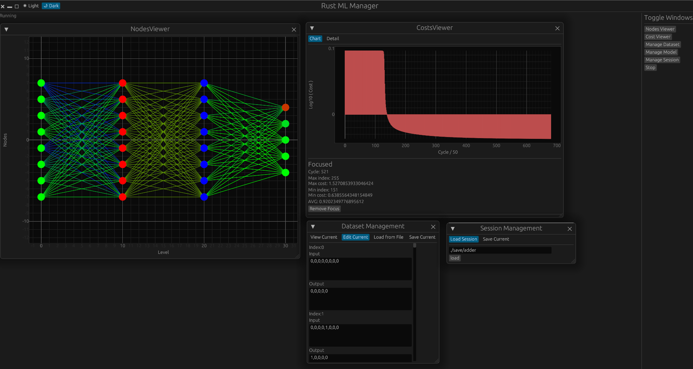
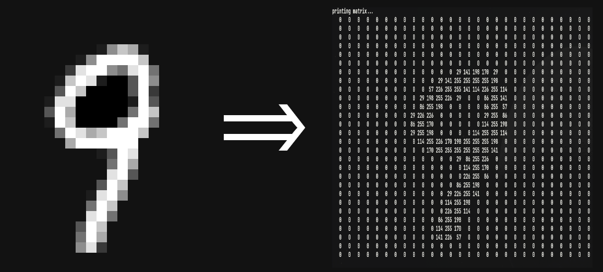
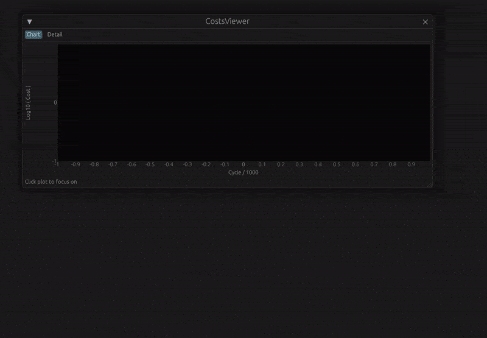
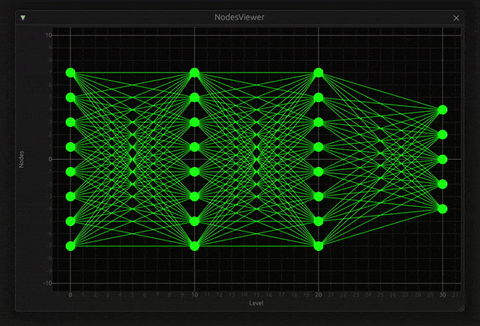

# Rust ML Toolkit

Rust Machine Learning Toolkit from scratch



## Purpose

- I created this project to study deep in ml.
- I wanted to learn how various frameworks work.

## Concept

- This project has 3 parts like below

### 1. Core

the core feature of toolkit.
implementation of matrix, neural network,
and various internal methods for that

### 2. Adapter

provide utility feature to user
by interacting with core and
manipulating data

### 3. Manager

GUI layer of project
interact with user

## This project includes

i will call neural network as NN.

### 1. Core

#### 1.1 NN & matrix

1.  matrix operations
2.  CRUD

#### 1.2 learning methods

1.  finite difference
2.  back propagation

### 2. Adapter

#### 1. Context & Session

manage state of model (NN)
save or load model or dataset

#### 2. image

convert img to 2d matrix and vice versa



### 3. GUI manager

1.  cost info

    

2.  network view & node state info

    

# How to run this project?

clone this project and just

```bash
cargo run

```

will launch the GUI manager
